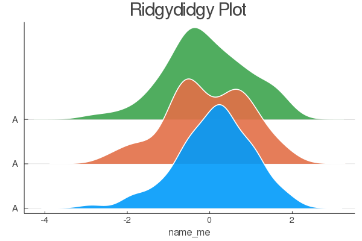

# Ridgeline.jl
Ridgeline (Joy) plotting for Julia


# ReadMe

ridgeline.jl is a package for generating ridgeline (a.k.a. Joy) Plots in Julia. Works best with `pyplot()` but also works with `gr()`

## Quick Install
```
using Pkg
Pkg.add(PackageSpec(url="https://github.com/bencamm001/ridgeline.jl.git", rev="main"))
using Ridgeline
```


## Quick Guide
Once installed, a default ridgeline plot can be made usuing `Ridgeline.ridgeline()`



## Arguments

`data` : An array of values that are to be plotted. Each column represents a categorical variable. The default array is a 100x3 randn distribution.

`ylabels` : An array of categorical labels for each column of data. The default is `["AAA", "AAA", "AAA"]`. *please note:* each variable in the array needs a single space each side of the name as for some reason the first and last characters are removed.

`colors` : An array of colors for each ridgeline, can be either string or hex or Int64.

`spacer` : A Float64 value that changes the spacing between each ridgeline. Value should be greater than 0, low values make the spacer between ridgelines smaller. Default is 0.5.

`riser` : A Float64 value that is used to slightly change the elevation of each ridgeline above the gridlines. Looks best when just above. Default is 0.001.

`plottitle` : A String giving a title. Default is "Ridydidgy Plot".

`plotxlab` : A String for labelling the x-axis. Default is "name_me".

`xlabsize` : An Int64 to change the size of the x-axis ticks. Default is 10.

`ylabsize`: An Int64 to change the size of the y-axis ticks. Default is 10.

`titlesize` : An Int64 to change the size of the title. Default is 20.

`hlinecolor` : A String to change the color of the horizontal lines beneath each ridgeline. Default is "grey".

`hlw` : A Float64 to change the line wieght of the horizontal lines beneath each ridgeline. Default is 0.4.

`halpha` : A Float64 to change the opacity of the horiztonal lines beneath each ridgeline. Default is 0.8.

`ridgealpha` : A Float64 to change the opacity of the fill for each ridgeline. Default is 0.9.

`ridgeoutline` : A String to change the color of the outline of each ridgeline. Default is "white".

`ridgelw` : A Float64 to change the line weight of the outline of each ridgeline. Default is 2.0.
